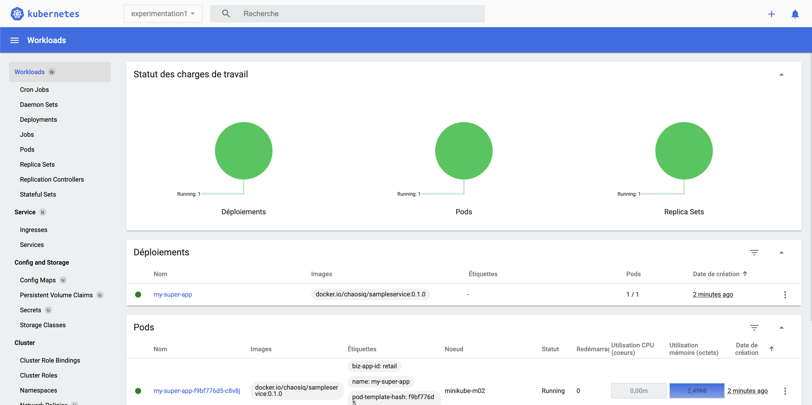

# Experimentation 1 : 💀 Supprimer un pod

> 🚨 Avant tout chose vérifiez si vous êtes bien dans le bon contexte, à savoir celui de **minikube** toujours à l'aide de la commande :
````
kubectl config get-contexts
````

## Instructions

Créer un namespace appelé *experimentation1* :

````
kubectl create namespace experimentation1
````

Voici la sortie de la console attendue :

````
namespace/experimentation1 created
````

Placez vous dans le dossier *experimentation1*  :
````
cd experimentation1
````

Placez vous dans ce namespace :
````
kubectl config set-context --current --namespace=experimentation1
````

Vous pouvez appliquer les fichiers de ressources mis à votre disposition il y'a un deployment et un service, à l'aide de la commande :
`````
kubectl apply -f deployment.yaml && kubectl apply -f service.yaml
`````

Vérifier que le pod est à l'état running soit au travers de la cli soit au travers du dashboard (que vous avez ouvert précédement) :

`````
kubectl get pods -owide
`````




Récupérer l'url via cette commande, garder l'url car il faudra la renseigner dans le fichier de l'experimentation 1 à la ligne 18 [experiment_1_deleting_pod](./experiment_1_deleting_pod.yaml)  :

````
minikube service list -n experimentation1
````

|    NAMESPACE     |    NAME    | TARGET PORT |            URL             |
|------------------|------------|-------------|----------------------------|
| experimentation1 | my-service |        8080 | url à récupérer et à coller à la ligne 18 du fichier [experiment_1_deleting_pod](./experiment_1_deleting_pod.yaml) |


Vous devez arriver sur une page similaire à celle-ci :


Regarder commment est constitué le fichier [experiment_1_deleting_pod](./experiment_1_deleting_pod.yaml). 
N'oubliez pas de remplacer l'url à la ligne 18 par la votre !

Vous allez pouvoir en premier lieu valider la syntaxe de la première expérimentation à l'aide de la commande : 
````
chaos validate experiment_1_deleting_pod.yaml
````

Puis vous allez pouvoir lancer l'expérimentation : 
````
chaos run experiment_1_deleting_pod.yaml
````

Côté dashboard vous constatez qu'un pod s'est bien fait supprimé :


Côté sortie console vous aurez une sortie similaire :
````
[INFO] Validating the experiment's syntax
[INFO] Experiment looks valid
[INFO] Running experiment: Est-ce que mon application peut maintenir son nombre minimum de ressources ?
[INFO] Steady-state strategy: default
[INFO] Rollbacks strategy: default
[INFO] Steady state hypothesis: Mon application est disponible
[INFO] Probe: ma-super-app-repond-normalement
[INFO] Steady state hypothesis is met!
[INFO] Playing your experiment's method now...
[INFO] Action: terminate-db-pod
[INFO] Pausing after activity for 5s...
[INFO] Steady state hypothesis: Mon application est disponible
[INFO] Probe: ma-super-app-repond-normalement
[ERROR]   => failed: failed to connect to http://192.168.64.32:31314: HTTPConnectionPool(host='192.168.64.32', port=31314): Max retries exceeded with url: / (Caused by NewConnectionError('<urllib3.connection.HTTPConnection object at 0x10e864850>: Failed to establish a new connection: [Errno 61] Connection refused'))
[WARNING] Probe terminated unexpectedly, so its tolerance could not be validated
[CRITICAL] Steady state probe 'ma-super-app-repond-normalement' is not in the given tolerance so failing this experiment
[INFO] Experiment ended with status: deviated
[INFO] The steady-state has deviated, a weakness may have been discovered
````

Que se passe t'il ?
>

# 🎉 Félicitations vous avez observé une faiblesse ! Il y'a bien un problème dans la configuration actuelle 

Que pourrions nous faire *très simplement* pour éviter ce genre de situation ?
> La réponse est de S _ _ _ E - _ P

La solution se trouve ici [solution détaillée](solution/README.md)

